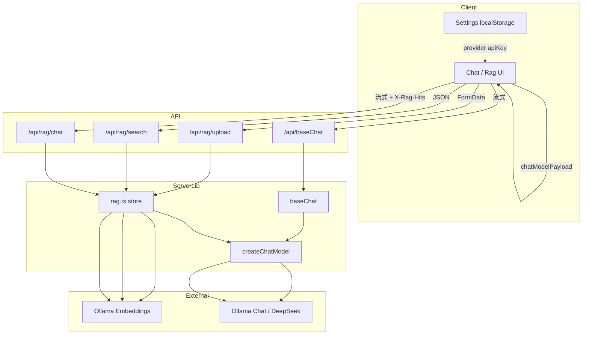

# 关键文件与数据流

> 对应 `ROADMAP.md` **阶段一**：吃透现有代码。  
> 目标：能独立讲清每个主要文件做什么、请求从哪进到哪出。

更细的 RAG 步骤见 [`RAG.md`](./RAG.md)；全局百科见根目录 `CODE_WIKI.md`。

---

## 1. 怎么读这份文档

项目是 **Next.js App Router 全栈**：页面在 `app/(main)/`，业务 UI 在 `components/`，真正调模型 / 向量库的逻辑在 `lib/server/`，API 路由只做「收参 → 调 lib → 回包」。

```
浏览器 UI (components/)
    ↓ fetch / FormData
API Route (app/api/**/route.ts)     ← 薄壳：解析 body、拼 Response
    ↓
lib/server/*                        ← 核心业务
    ↓
Ollama / DeepSeek                   ← 外部模型服务
```

**边界约定：**

| 位置 | 能做什么 | 不能做什么 |
|------|----------|------------|
| `components/`（`"use client"`） | hooks、localStorage、fetch、WebGL | 直接 import `lib/server/*` |
| `lib/server/` | LangChain、内存 store、读 `config.ts` | 被客户端组件引用 |
| `lib/settings.ts` | 浏览器读写设置 | 放服务端密钥兜底以外的逻辑 |
| `config.ts` | 读环境变量 | 依赖浏览器 API |

---

## 2. 目录鸟瞰（只列关键路径）

```
app/
  layout.tsx                 # 根布局：字体、globals.css
  (main)/layout.tsx          # 主壳：NavTabs 包住所有业务页
  (main)/page.tsx            # / → Home
  (main)/chat/page.tsx       # /chat → Chat
  (main)/rag/page.tsx        # /rag → Rag
  (main)/docs/page.tsx       # /docs → Docs
  (main)/settings/page.tsx   # /settings → Settings
  api/baseChat/route.ts
  api/pipe/route.ts
  api/rag/{upload,search,chat,status}/route.ts

components/
  NavTabs.tsx                # 顶栏 + 主题；children 即页面内容
  Chat/                      # 流式对话 UI
  Rag/                       # 上传 / 检索 / RAG Chat
  Settings/                  # Ollama ↔ DeepSeek
  Home/ + Grainient/        # 品牌页 + WebGL 背景
  Docs/                      # 站内静态说明

lib/
  settings.ts                # localStorage 设置 + chatModelPayload()
  api/client.ts              # JSON ApiResponse 封装（流式聊天未用）
  server/
    model.ts                 # createChatModel / parseModelOptions
    chat.ts                  # baseChat / streamWithPipe
    rag.ts                   # 切块、嵌入、检索、streamRagChat
    response.ts              # successResponse / errorResponse
    index.ts                 # barrel：API 路由统一从这里 import

constants/
  api.routes.ts              # /api/... 路径常量
  app.routes.ts              # 页面路径 + NAV_TABS + isNavTabActive

types/
  api.ts                     # ApiResponse<T>
  settings.ts                # AppSettings / LlmProvider

config.ts                    # Ollama + DeepSeek 环境变量配置
app/globals.css              # Tailwind v4 @utility（样式入口）
```

页面文件本身几乎只是 `export default` 对应组件，**真正逻辑在 components + lib/server**。

---

## 3. 关键文件职责表

### 3.1 配置与类型

| 文件 | 作用 |
|------|------|
| `config.ts` | 服务端模型配置唯一来源：`OLLAMA_*`、`DEEPSEEK_*`。聊天温度、host、模型名都从这里读。 |
| `types/settings.ts` | `LlmProvider`、`AppSettings`、默认值。前后端共用类型名。 |
| `types/api.ts` | JSON 接口统一形状 `{ code, message, data }`。 |
| `constants/api.routes.ts` | 前端 `fetch` 用的 API 路径，避免魔法字符串。 |
| `constants/app.routes.ts` | 页面路由、`NAV_TABS`、Tab 激活判断。 |

### 3.2 前端设置与请求

| 文件 | 作用 |
|------|------|
| `lib/settings.ts` | `readSettings` / `writeSettings`（key: `th-settings`）；`chatModelPayload()` 把 `provider` +（DeepSeek 时）`apiKey` 塞进聊天请求 body。 |
| `components/Settings/index.tsx` | 切换 Ollama / DeepSeek、填 API Key，写入 localStorage。 |
| `lib/api/client.ts` | 约定 `code === 0` 的 JSON 客户端。**Chat / RAG Chat 流式不用它**（它们读 `text/plain` 流）。 |

### 3.3 服务端核心

| 文件 | 作用 |
|------|------|
| `lib/server/model.ts` | `parseModelOptions(body)`：从请求体安全解析 provider/apiKey。`createChatModel()`：Ollama → `ChatOllama`，DeepSeek → `ChatOpenAI`（OpenAI 兼容）。**嵌入始终走 Ollama，不在这里切换。** |
| `lib/server/chat.ts` | `baseChat`：System + Human → `model.stream()` → `ReadableStream`。`streamWithPipe`：LangChain 链式 `Prompt → model → StringOutputParser`（硬编码「资深程序员」人设）。`toTextContent` 把 chunk.content 抽成纯文本。 |
| `lib/server/rag.ts` | 内存 `store[]`；`splitText` → `embedDocuments` → 入库；`searchRag` 余弦相似度 Top-K；`streamRagChat` 先检索再生成，并返回 `hits`。 |
| `lib/server/response.ts` | `successResponse` / `errorResponse`：JSON 成功/失败包装。流式成功路径不走这里。 |
| `lib/server/index.ts` | 对外 barrel，API route 只 import `@/lib/server`。 |

### 3.4 API 路由（薄壳）

| 文件 | 入参 | 成功响应 | 调用 |
|------|------|----------|------|
| `app/api/baseChat/route.ts` | `{ msg, systemMsg, provider?, apiKey? }` | `text/plain` 流 | `baseChat` |
| `app/api/pipe/route.ts` | `{ msg, systemMsg?, provider?, apiKey? }` | `text/plain` 流 | `streamWithPipe` |
| `app/api/rag/upload/route.ts` | multipart `file` + 可选 `clear` | JSON `ApiResponse` | `ingestText` / `clearRagStore` |
| `app/api/rag/search/route.ts` | `{ query, k? }` | JSON + hits | `searchRag` |
| `app/api/rag/chat/route.ts` | `{ msg, provider?, apiKey? }` | `text/plain` 流 + 头 `X-Rag-Hits` | `streamRagChat` |
| `app/api/rag/status/route.ts` | 无 | JSON 块数与来源 | `getRagStatus` |

错误统一：`errorResponse(message)` → JSON，HTTP 多为 500（校验失败可传 400）。

### 3.5 UI 组件

| 文件 | 作用 |
|------|------|
| `components/NavTabs.tsx` | 顶栏导航、主题切换；`children` 渲染当前页。 |
| `components/Chat/index.tsx` | 消息列表 + 角色预设（改 `systemPrompt`）+ `fetch(BASE_CHAT)` 流式读入；`AbortController` / `reader.cancel` 停止生成。 |
| `components/Chat/MsgBlock/index.tsx` | 单条气泡；`markdown-it`（`html: false`）渲染后 `dangerouslySetInnerHTML`。 |
| `components/Rag/index.tsx` | 三块能力：上传 FormData、JSON 检索可视化、RAG Chat 流式（并解析 `X-Rag-Hits`）。 |
| `components/Home` + `Grainient` | 品牌 Hero；Grainient 为 OGL WebGL，必须 client-only。 |
| `components/Docs` | 站内 RAG 说明页（产品文档 UI，不是本文件）。 |
| `app/globals.css` | 组件样式以 `@utility` 定义（如 `chat-panel`、`msg-bubble-ai`），组件里用这些类名，不直接堆 Tailwind 原子类。 |

---

## 4. 数据流

### 4.1 Chat（`/chat` → `/api/baseChat`）

当前 Chat 默认走 **`BASE_CHAT`**（可配置 system prompt），不是 `/api/pipe`。

```
用户输入 + 可选 systemPrompt（「前端」/「全栈」按钮写入）
  → Chat.handleSubmit
  → fetch POST /api/baseChat
       body: { msg, systemMsg, ...chatModelPayload() }  // provider / apiKey
       signal: AbortController
  → baseChat/route.ts
  → parseModelOptions(body) + baseChat(msg, systemMsg, signal, options)
  → createChatModel() → ChatOllama 或 ChatOpenAI
  → model.stream([SystemMessage, HumanMessage])
  → ReadableStream(text/plain) 逐 chunk enqueue
  ← response.body.getReader() + TextDecoder
  ← setMessages 更新对应 aiMsgId 的 content
  ← MsgBlock markdown 渲染
```

**停止生成：** 已有 reader → `reader.cancel()`；尚在等响应 → `controller.abort()`（与 `request.signal` 联动，服务端 `baseChat` 会关流）。

**`/api/pipe`：** 仍保留，硬编码资深程序员 prompt + LangChain pipe；页面未默认调用，可当对照学习。

### 4.2 设置如何影响聊天

```
Settings 页 writeSettings({ provider, deepseekApiKey })
  → localStorage["th-settings"]

Chat / Rag Chat 发请求前
  → chatModelPayload()
  → body.provider / body.apiKey

服务端 createChatModel
  → deepseek：用 body.apiKey，否则 config DEEPSEEK_API_KEY
  → ollama：忽略 apiKey，连 OLLAMA_HOST
```

注意：**RAG 嵌入**（`OllamaEmbeddings`）固定本地 Ollama；只有「生成回答」的 chat model 可切 DeepSeek。

### 4.3 RAG 上传

```
Rag 表单 <input type="file"> + 可选 clear=1
  → FormData POST /api/rag/upload
  → 校验扩展名 (.txt/.md/.markdown)、≤1MB
  → 可选 clearRagStore()
  → file.text() → ingestText(text, file.name)
       splitText(400, overlap 60)
       → embeddings.embedDocuments(chunks)
       → store.push({ content, embedding, source })
  ← JSON { source, addedChunks, chunkCount, sources }
  ← 前端刷新 status 文案
```

`store` 是模块级数组：**进程重启 / Next 热重载会清空**（demo 刻意不做持久化）。

### 4.4 RAG 仅检索

```
query → POST /api/rag/search { query, k }
  → searchRag：embedQuery → 与 store 余弦相似度 → Top-K
  ← JSON { hits: [{ content, source, score }] }
  ← 前端列表展示分数（不调 LLM）
```

### 4.5 RAG Chat（检索 + 生成）

```
用户问题
  → fetch POST /api/rag/chat { msg, ...chatModelPayload() }
  → streamRagChat
       ① searchRag(msg, 4)
       ② 把 hits 拼进 SystemMessage「检索上下文」
       ③ createChatModel().stream(...)
  ← Response：
       headers: X-Rag-Hits = encodeURIComponent(JSON.stringify(hits))
                Access-Control-Expose-Headers: X-Rag-Hits
       body: text/plain 流
  ← 前端：decodeURIComponent + JSON.parse 头 → 挂到该条 AI 消息的 hits
  ← 同时 getReader() 流式更新 content
```

为何用响应头带 hits：body 已经是纯文本 token 流，不便再塞 JSON；头里一次带上检索结果即可展示相似度。

### 4.6 端到端总图



---

## 5. 阶段一三个自检问题（答案要点）

1. **`store` 为什么进程重启就清空？**  
   它是 `lib/server/rag.ts` 里的普通模块级数组，没有写磁盘 / 外部向量库。Node 进程没了，内存就没了；dev 热更新也可能重载模块导致清空。

2. **`X-Rag-Hits` 前端怎么解析？**  
   `response.headers.get("X-Rag-Hits")` → `decodeURIComponent` → `JSON.parse` 成 `RagHit[]`。服务端用 `encodeURIComponent` 是为了头里能安全带中文文件名；并设置 `Access-Control-Expose-Headers` 以便浏览器脚本可读自定义头。

3. **`markdown-it` 为什么 `html: false`？**  
   模型或用户内容可能夹带 `<script>` 等 HTML；关掉原生 HTML 后，再 `dangerouslySetInnerHTML` 只注入 markdown 转出的安全标签，降低 XSS。

---

## 6. 跟调清单（建议动手顺序）

1. 在 `Chat.handleSubmit` 打断点 → 跟到 `baseChat` → 看 `ReadableStream` 如何 enqueue。  
2. 上传一个小 `.md` → 跟 `ingestText` → 看 `store.length`。  
3. 开 RAG Chat → 在 Network 面板看响应头 `X-Rag-Hits` 与 body 流式增长。  
4. 设置页切 DeepSeek → 确认请求 body 带 `provider`/`apiKey`，且上传仍依赖本机 Ollama 嵌入。

---

*对应项目：my-agent-demo · 配合 ROADMAP 阶段一*
